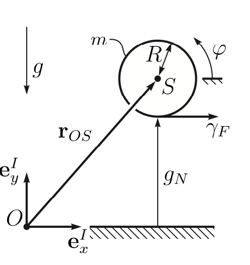

Bouncing ball with frictional contact
=====================================

Introduction
++++++++++++

We look at a homogeneous rigid sphere of radius :math:`R` and mass :math:`m` which is constrained to move in the (:math:`\mathbf{e}_x^I`-:math:`\mathbf{e}_y^I`)-plane and which under the influence of gravity with gravitational acceleration :math:`g=9.81` falls on a horizontal plane. To parametrize the motion of the ball, we choose the minimal coordinates :math:`\mathbf{q} = (x\ y\ \varphi)^T`, where the center of mass :math:`S` of the sphere is addressed by the representation :math:`{}_I\mathbf{r}_{OS} = (x\ y\ 0)^T` of the position vector :math:`\mathbf{r}_{OS}` with respect to the basis :math:`I`. Moreover, the angle :math:`\varphi` describes the orientation of the sphere. The velocity parameters :math:`\mathbf{u}=(u_x\ u_y\ u_\varphi)^T` are chosen to correspond to :math:`\dot{\mathbf{q}}` whenever the time derivative of the coordinates exist. Consequently, we have

.. math::
    :nowrap:

        \begin{equation}
            \mathbf{M} = 
            \begin{pmatrix}
                m & 0 & 0\\
                0 & m & 0\\
                0 & 0 & \theta_S
            \end{pmatrix}
            \quad\text{and}\quad \mathbf{h} = 
            \begin{pmatrix}
                0\\
                -mg\\
                0
            \end{pmatrix}
        \end{equation}

with the rotational inertia $\theta_S=\frac{2}{5}m R^2$ of the sphere. Finally, the contact with the plane is described by the gap function 

.. math::
  :nowrap:

        \begin{equation}
            g_N = y-R\quad\text{and}\quad \gamma_F = u_x + R u_\varphi\,,
        \end{equation}

which is the relative horizontal velocity of the contact point with respect to the plane.
